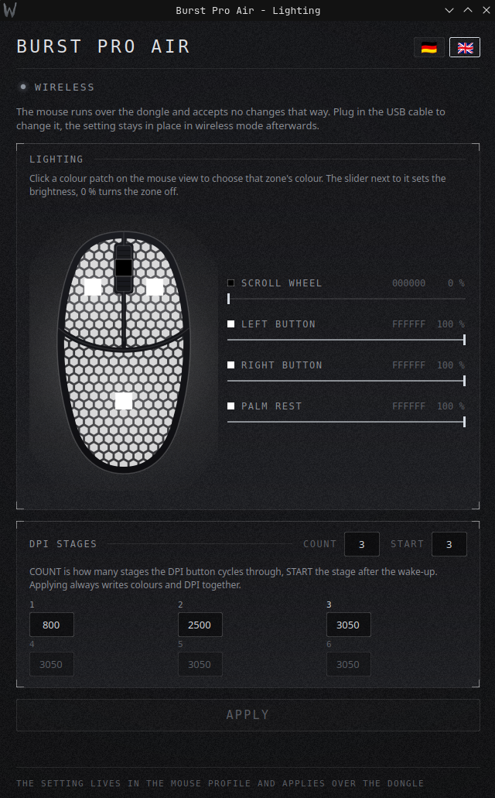

# Burst Pro Air

Lighting and DPI control for the ROCCAT Burst Pro Air on Linux.



ROCCAT never shipped Swarm for Linux, and the two tools that would normally step
in do not reach this mouse. OpenRGB's driver was written for the wireless dongle
and sends a packet header that the current firmware ignores; Eruption does not
know either device ID. So I recorded the USB traffic with `usbmon` while Swarm
was setting colours inside a VM, and rebuilt the protocol from the captures. The
packets this sends are byte-identical to Swarm's.

Everything goes into the profile stored inside the mouse, so the colours and the
DPI stages survive a reboot and stay in place over the dongle.

## Requirements

* Python 3 and PyQt6 (`python3-pyqt6` on Fedora and Nobara, `python3-pyqt6` on
  Debian and Ubuntu). The command line tool needs Python alone.
* The mouse plugged in **by cable** (`1e7d:2cab`). The dongle (`1e7d:2ca6`) will
  not accept these packets, so plug the cable in to change something and unplug
  it afterwards.

Written on Nobara 44 with KDE, Python 3.14 and PyQt6 6.11.

## Use

The window, with a drawn top view of the mouse. Click a colour patch to pick the
colour of that zone, the slider next to it sets the brightness:

```
./burst-pro-air
```

Or from a shell, one argument per zone in the order scroll wheel, left button,
right button, palm rest:

```
./bpa_led.py 000000:0 FFFFFF FFFFFF FFFFFF          # wheel off, the rest white
./bpa_led.py D8E04A FF9D2E FF9D2E 3FD23F            # a colour per zone
./bpa_led.py FFFFFF FFFFFF FFFFFF FFFFFF 800,2500,3050:3
```

A zone is `RRGGBB` or `RRGGBB:brightness` with brightness in percent. The last
argument holds one to six DPI stages, optionally followed by `:startstage`, the
stage the mouse wakes up on.

For a desktop entry, copy `burst-pro-air.desktop` to
`~/.local/share/applications/` and fix the paths in it.

## Permissions

The tool writes to `/dev/hidraw*`. If OpenRGB is installed its udev rule already
opens that up; otherwise install the rule shipped here:

```
sudo cp udev/99-roccat-burst-pro-air.rules /etc/udev/rules.d/
sudo udevadm control --reload && sudo udevadm trigger
```

Then replug the cable.

## What it cannot do

* Read the current settings back. The mouse answers every read command with the
  same status packet and never with configuration data, so the tool keeps its
  own copy in `~/.config/burst-pro-air/zonen.json`.
* Write colours without DPI. The mouse only accepts the DPI block together with
  the lighting pages, so applying always writes both. If you change the stages
  in Swarm later, the next apply puts the stored ones back.

## Protocol

[docs/protocol.md](docs/protocol.md) has the whole thing: transport, the command
sequence, both block layouts, the checksum and its start value, and the reports
the mouse sends when you press its DPI button. Enough to add the device to
another tool.

## License

GPL-3.0-or-later.
